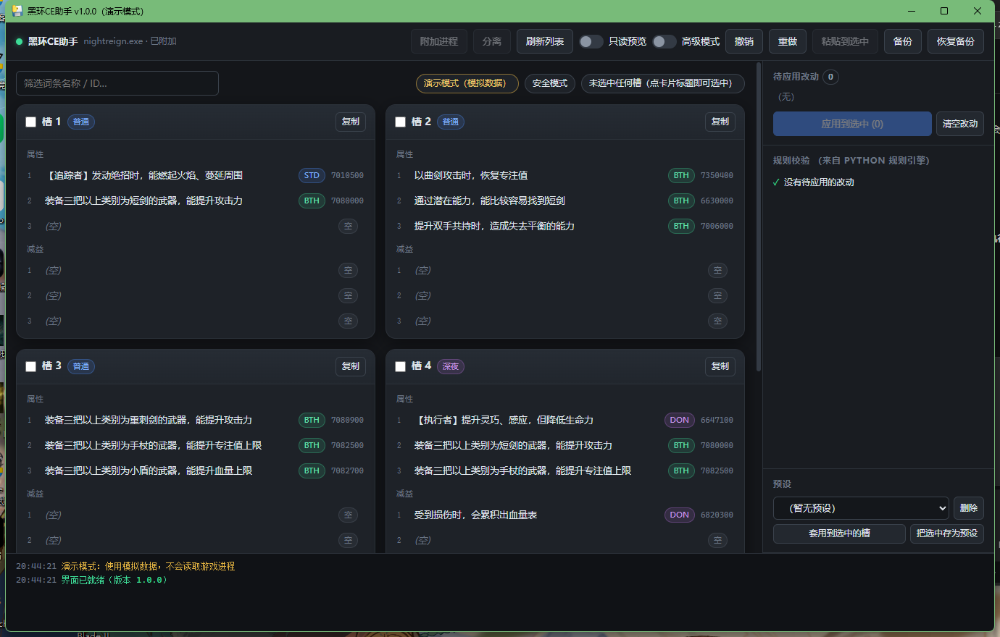

# 黑环CE助手 · BlackRing CE Assistant

**v1.0.0** ｜ 适用于《艾尔登法环：黑夜君临》的**离线遗物修改器**

> ## ⚠️ 免责声明与使用边界（务必先读）
>
> 本项目**仅供学习研究与离线 / 私人测试环境使用**。
>
> - **禁止**用于在线作弊、联机篡改、反作弊绕过，或任何破坏其他玩家公平性的行为。
> - 请遵守《艾尔登法环：黑夜君临》服务条款（ToS）与当地法律法规。
> - 一切使用后果由使用者自行承担。
>
> 本项目不附带任何游戏数据文件，也不包含第三方 Cheat Engine 表的副本。

---

## 这是什么

一个**专用**的遗物修改器，不是通用 Cheat Engine 替代品。它做的事只有一件：

> 读取你**已装备的 6 个遗物槽**，修改它们的**属性 1–3** 与**减益 1–3**，再写回游戏内存。

词条数据来自 Hexinton 汉化版 CT 表导出的枚举，所以下拉里能选到的内容与 CE 里**完全一致**。

**特性**：离线可用 · 不依赖 Cheat Engine 客户端 · 中文界面 · 卡片式操作 · 写入前规则校验 · 全程可撤销



*上图是演示模式（`python main.py --demo`）—— 不需要游戏就能看到界面长什么样。*

---

## 文档导航

| 文档 | 内容 |
|------|------|
| 本文件 | 总览、安装、完整使用说明、FAQ、开发与打包 |
| [docs/USER_GUIDE.md](blackring_ce_assistant/docs/USER_GUIDE.md) | 使用说明（精简版，适合随程序一起看） |
| [docs/ARCHITECTURE.md](blackring_ce_assistant/docs/ARCHITECTURE.md) | 架构与分层设计 |
| [docs/FIELD_MAPPING.md](blackring_ce_assistant/docs/FIELD_MAPPING.md) | 内存字段 / 偏移映射 |
| [docs/DISCLAIMER.md](blackring_ce_assistant/docs/DISCLAIMER.md) | 免责声明全文 |

---

## 功能

### 核心

- 附加 `nightreign.exe`，AOB + RIP 相对定位符号（**不写死绝对地址**）
- 读取 / 写入 6 槽的**属性 1–3**与**减益 1–3**
- 词条下拉来自 CT 的 `RelicIDStd` / `RelicIDDoN` / `RelicIDDebuff`
- **写入前实时校验**：兼容性 · Roll_Order · Roll_Group · Req_Debuff · 空位连续

### 操作

- **卡片工作台**：6 个遗物各一张卡片同屏，点任意一行改词条
- **拖拽**：卡内拖动交换属性顺序；拖到别的卡片把词条搬过去
- **先暂存、后应用**：所有修改（含复制、套预设）先进「待应用改动」，确认后一次性写入
- 批量写入 · 复制/粘贴 · 预设保存与套用 · 备份与恢复 · 撤销/重做（栈深 20）
- 默认**只读预览**；批量写入二次确认；失败自动回滚

### 高级模式

- 取消全部合法性检查
- 属性与减益的候选都换成 CT **全量表（`RelicID`，1076 条）**，并按 CT 自带的 8 个分组显示：
  `攻击 / 角色 / 装备 / FP·HP 恢复 / 潜伏之力 / 杂项 / 诅咒 / 非法`
- 支持**手动输入任意 ID**（`7001400`、`0x6ADB30`、`-1` 表示清空）

---

## 快速开始

### 方式一：下载发布版（推荐）

1. 到本仓库 **Releases** 页下载 `黑环CE助手_v1.0.0.zip`
2. 解压到任意目录（**绿色版，无需安装**）
3. 双击 `黑环CE助手_v1.0.0.exe`

压缩包里同时附有 `使用说明.md`、`README.md` 与 `LICENSE`，离线也能查。

需要系统装有 **WebView2 运行时**（Windows 11 自带；Windows 10 多数已随 Edge 安装）。
缺失时程序会弹出提示并给出微软官方下载地址。

### 方式二：从源码运行

```bat
git clone https://github.com/<你的用户名>/黑环ce助手.git
cd 黑环ce助手\blackring_ce_assistant
python -m venv .venv
.venv\Scripts\activate
pip install -r requirements.txt
python main.py
```

想先看看界面长什么样（**不需要游戏、不需要存档**）：

```bat
python main.py --demo
```

演示模式使用内存里的模拟数据，走的是与真实模式**完全相同**的代码路径。

---

## 使用说明

### 改遗物的完整流程

| 步骤 | 操作 |
|------|------|
| 1 | 启动游戏并**进入存档**，然后点界面顶部「**附加进程**」 |
| 2 | 点**卡片标题**选中要改的槽（不是点那个小方框）；可多选，但**不能同时选普通与深夜** |
| 3 | 点卡片上的词条行改词条（候选列表里可搜名称或 ID） |
| 4 | 看右侧「**待应用改动**」与「规则校验」 |
| 5 | 点「**应用到选中**」写内存 |

> **所有修改都是先暂存、后应用。** 你可以逐条检查、看校验结果，确认无误再一次性写入。
> 中途反悔就点「清空改动」，不会动内存。

### 界面速查

| 想做什么 | 怎么做 |
|----------|--------|
| 改一个词条 | 点那一行 → 搜名称或 ID → 点选 |
| 手输任意 ID | **高级模式**下，候选列表底部有「手动 ID」输入框 |
| 交换属性顺序 | 在卡片内把一行**拖到**另一行上 |
| 把词条搬到别的槽 | 把一行**拖到**另一张卡片上 |
| 复制整套词条 | 卡片标题右侧「复制」→ 选中目标槽 → 顶部「粘贴槽N 到选中」 |
| 批量修改 | 多选卡片标题 → 改词条 → 应用到选中（>6 项会二次确认） |
| 存 / 套预设 | 右侧「预设」区：把选中槽存为预设，或把预设套用到选中的槽 |
| 备份 / 恢复 | 顶部「备份」写快照；「恢复备份」回到快照（会二次确认） |
| 撤销 / 重做 | 顶部按钮 |

### 两种模式

| 模式 | 说明 |
|------|------|
| **只读预览**（默认） | 只能看不能写；改动仍可暂存，但「应用」会被拒绝 |
| **编辑** | 取消勾选「只读预览」后可写 |
| **高级模式** | 取消全部校验，候选换成 CT 全量表（可跨类选择） |

> 高级模式是给知情用户的**逃生口**，不是「更方便的编辑模式」——
> 它允许写入游戏内非法的组合，可能造成存档异常。

### 「应用」为什么点不动

只要存在**阻断性规则冲突**，「应用到选中」就会被置灰，并在按钮上显示「· 有 N 项冲突」；
同时「待应用改动」里非法的那几条会**标红打 ✗**，鼠标悬停可看具体原因。

这是刻意的：后端本来也会拒绝，与其让你白点一次再吃一个错误弹窗，不如当场说清楚。

> **常见情形**：在高级模式下配好一套改动，切回安全模式后它们可能不合法。
> 此时改动**不会被丢弃**，只是被标出来 —— 修好或清空即可恢复可点。

---

## ⚠️ 安全须知（程序不替你拦截，请务必自己确认）

**本程序已彻底移除 RNG 安全门**：它不会阻止你修改任何遗物。修改前请自行按 CT 指南确认：

1. **卸下**要改的遗物（可能还需要把它从预设和其他角色身上移除）。
2. 打开**出售菜单**，看它能否被**高亮选中** —— 不要真的把它卖掉。
3. **能选中** → 它是随机(RNG)遗物，改它是安全的。
4. **不能选中** → 它是一件**唯一遗物，不要修改**，否则你的账号会被标记。

另外：

- 不要修改 1.02 及更早版本的遗物。
- **仅在离线环境使用**，不要用于联机。

---

## 常见问题

| 现象 | 原因与处理 |
|------|-----------|
| 附加失败 | 用管理员运行；确认进程名是 `nightreign.exe`；确认**已进入存档** |
| 附加成功但读不到遗物 | 多半是还没进存档 —— 符号能解析但槽位为空 |
| 符号解析失败（AOB 未命中） | 先看 `data/logs/` 的日志（含未命中的 pattern 与模块）；游戏更新后需重新抓特征码，改 `data/mapping.json` 的 `aob` |
| 界面白屏 / 一直不动 | 看 `data/logs/` 里有没有「界面已就绪」；没有则是 WebView2 初始化失败，重启程序即可 |
| 提示缺少 WebView2 | 按弹窗给的微软官方链接安装 Evergreen Runtime |
| 空槽显示「(空)」 | 正常：内存中的空位 `0xFFFFFFFF` 会被归一化为 `-1` |
| 候选里出现「[当前值] 未知」 | 正常：该 ID 不在枚举里（高级模式写入的怪 ID），界面把它补进列表以免被误清掉 |
| 打包时 PermissionError | 旧版本程序还在运行，先结束进程 |

### 日志

运行日志写在 `data/logs/app-YYYYMMDD.log`（源码态在项目根，发布版在程序同目录）。
界面上的错误提示只是摘要，**完整 traceback 只在日志文件里** —— 反馈问题时请一并附上。

---

## 项目结构

```text
黑环ce助手/                      ← 仓库根
├── README.md                    本文件（完整说明书）
├── LICENSE                      GPL-3.0
└── blackring_ce_assistant/      程序本体
    ├── main.py                  入口（转调 webui.main；支持 --demo）
    ├── run_tests.py             零依赖测试运行器
    ├── build.py / webui.spec    打包（PyInstaller onedir）
    ├── tools_export_ct.py       从 CT 重新导出 data/
    ├── tools_diag_live.py       实机诊断：AOB 命中、符号地址、6 槽读数
    ├── tools_diag_dump.py       对象 hexdump 校验
    ├── tools_dump_symbols.py    导出符号与地址，便于比对
    ├── domain/                  模型、枚举、规则（纯逻辑，可单测）
    ├── mapping/                 CT 解析、CE 地址表达式、映射配置
    ├── infra/memory/            内存后端、CE 指针链、AOB、事务、符号解析
    ├── app/services/            遗物服务：读槽 / 校验 / 批量写 / 撤销
    ├── webui/                   界面：bridge.py（前后端唯一接口）、serial.py（内存操作串行化）、
    │                            demo.py（演示后端）、web/（HTML/CSS/JS 前端）
    ├── data/                    mapping.json 与 effects_*.json（由 CT 导出）
    ├── tests/                   78 个单元 / 集成用例
    └── docs/                    架构说明、字段映射、使用说明、界面截图
```

### 设计要点

- **前端不实现任何业务规则**：候选列表与校验全部由 Python 提供，避免前后端两份规则漂移。
- **所有内存操作强制串行化**：界面回调来自不同线程，而指针求值器是共享状态。
- **写入走事务**：先备份 4 字节 → 写 → 失败全量回滚。
- **不写死地址**：符号靠 AOB + RIP 相对定位，AOB 的唯一来源是 `infra/memory/symbols.py`。

---

## 开发

### 测试

```bat
python run_tests.py              REM 零依赖，78 个用例
pytest tests/ -q                 REM 若已安装 pytest
```

界面层的端到端验证（在 WebView2 里**真实驱动界面**，并断言内存确实被写入）：

```bat
cd webui
..\.venv\Scripts\python.exe verify_ui.py
```

### 打包

```bat
python build.py
REM 产物: dist/黑环CE助手_v<版本>/（onedir 绿色文件夹，约 28MB）
REM 说明书与 LICENSE 会自动复制进该目录
```

> `build.py` **不会**清空 `dist/`：那里是各版本唯一的一份交付产物。

### 从 CT 重新导出词条

换用新版本 CT 时（词条翻译或增删有变化）：

```bat
python tools_export_ct.py "<CT 路径>" data
python run_tests.py
```

导出后请核对 `data/mapping.json` 的槽位偏移与 `effects_*.json` 的行数。

### 实机诊断（游戏运行时）

```bat
.venv\Scripts\python.exe tools_diag_live.py
.venv\Scripts\python.exe tools_diag_dump.py
```

`tools_diag_live` 打印 AOB 命中、符号地址与 6 槽读数；`tools_diag_dump` 做对象 hexdump 校验。

---

## 版本历史

| 版本 | 要点 |
|------|------|
| **1.0.0** | 首个对外发布版：整理仓库（不再收录任何二进制）、说明书提到仓库根并随发布包分发、版本号转正 |
| 0.7.0 | 界面重构为 pywebview + Web 前端（卡片工作台）；移除 PySide6；改 onedir 分发（45.8MB → 28MB） |
| 0.6.1 | 换用重新翻译的 CT；高级模式改用全量表 `RelicID`（1076 条）并按 CT 自带分组显示 |
| 0.6.0 | 移除 RNG 安全门；高级模式跨选（属性↔减益）+ 手动 ID |
| 0.5.1 | 集中修复一批已知缺陷（「重做」空操作、备份恢复必然失败、打包误删交付物、空槽读数归一化等 22 项） |
| 0.5.0 | 减益 1–3 可写 |
| 0.1–0.4 | 早期版本（旧 `vN` 产物名），逐步打通符号解析、读取与写入 |

版本号唯一来源：`app/version.py`。

---

## 已知限制

- 仅支持 **Windows 10/11 x64**，且需要 WebView2 运行时。
- 游戏更新后 AOB 特征码可能失效，需要重新抓取（见「实机诊断」）。
- 词条数据的完整度取决于所用 CT 表。
- 不含「遗物注入背包 / 生成道具 / 参数修改器」等 CT 里存在但本工具未接入的功能。

## 许可

本项目采用 **GNU General Public License v3.0**，全文见 [LICENSE](LICENSE)。

简单说：你可以自由使用、修改、再分发，但**衍生作品必须以同样的许可开源**。

> 注意：许可只覆盖本项目的代码与文档，**不覆盖任何游戏内容或第三方 CT 表**。

## 贡献

欢迎提交 Issue 反馈问题。提交前请附上 `data/logs/` 的日志 —— 里面有完整 traceback，
只描述现象往往无法定位。

## 致谢

- **Hexinton** 及 CT 表的汉化者：本项目的词条数据与内存结构理解全部来自该表。
- 本项目不附带、也不分发该 CT 表。

---

*仅供学习研究与离线测试。请勿用于联机或任何破坏公平性的用途。*
